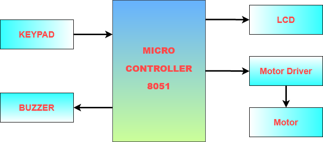
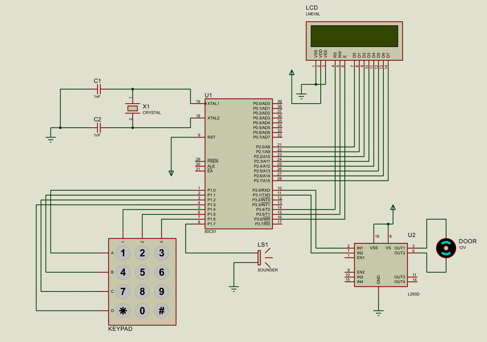
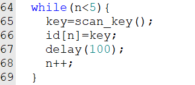
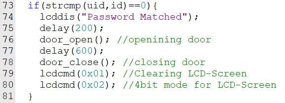

## NSU-CSE331-Password-Based-Door-Lock-Using-8051-Microcontroller

### Project Tittle:  Password based door lock system using 8051/PIC microcontroller
### Project Members:
    1.   Sayed Abu Noman Siddik (1811655042)
    2.   Abul Kalam (1811501642)

### Contents:
    •	Introduction
    •	Project Objective
    •	Principle Behind The Project
    •	Block Diagram
    •	Hardware Requirements
    •	Circuit Diagram
    •	Description and Working of Components
    •	Hardware and Software Application
    •	Algorithm
    •	Code Explanation
    •	Advantage and Disadvantage
    •	Future Scope
    •	References

### Introduction:
Nowadays most of the systems are automated in order to face new challenges and present day requirements to achieve good results. Automated systems have less manual operations, so that the flexibility, reliabilities are high and accurate. Hence the importance of a low cost electronic home security system designed in co-ordination with other security measure is always there in our society to reduce the risk of home intrusion.

### Project Objective:
The main objective of designing this password based door lock system is to provide many modern security features than mechanical lock and utilize our understanding in micro controller and Assembly Language learned through CSE331(Microprocessor Interfacing and Embedded System). Our other objective is to utilize different electronic parts available in the market and build an integrated home security system based on ICS, Microcontroller and LCD screen. We tried to build this project in order to obtain these goals:
        •	To develop a unique safety system through micro controllers.
        •	Unlock the door just by pressing pre-defined password through keypad.
        •	Increase the security level to prevent unauthorized access and increase flexibility of user.
        •	To give user more secure yet cos-efficient way of door locking-unlock system. 

### Principle Behind The Circuit:
The main component in the circuit is 8051 controller. In this project 4×3 keypad is used to enter the password. The password which is entered is compared with the predefined password.
If the entered password is correct then the system opens the door by rotating door motor and displays the status of door on LCD. If the password is wrong then door is remain closed and a sound alarm is triggered and displays “Password is wrong” on LCD.
### Block Diagram: 
 

### Hardware Requirements:
1.	80C51 Microcontroller
2.	Programming cable
3.	4 * 3 Matrix Keypad
4.	16 *2 LCD
5.	DC Motor
6.	Capacitor
7.	Crystal
8.	L293D-Push-Pull Four Chanel Driver with Diodes
9.	Sounder
10.	Power
11.	Ground
### Proteus Design:

 

### Description and Working of Components:
#### Reset Circuit Design:
The reset pin of the microcontroller is kept active till the power supply is in the specified range and a minimum oscillation level is maintained.  In other words to ensure the supply voltage does not falls below the threshold level of 1.2V.

#### Oscillator Circuit Design: 
A crystal oscillator is used to provide external clock signal to the microcontroller. To ensure smooth operation, we connect two ceramic capacitors ranges from 20pF to 40pF. This crystal oscillator is connected between pin 18 and 19 of the microcontroller.
#### L.C.D: 
Here we are using a 16x2 L.C.D which is a dot matrix Liquid Crystal Display. Its function is to display the alphanumeric symbols to indicate the status message of the circuit. This L.C.D can display the two lines and each line contains 16 characters. This L.C.D contains an internal oscillator circuit to work in synchronization with the controller. Data pins of LCD is connected to port P2 from P2.0-P2.7 describing the current status of system and three control pins RS, RW and E are connected to port P3 from P3.4-P3.6 respectively.
#### D.C Motor Drive: 
It is a machine used to convert the electrical energy into mechanical energy. This D.C motor uses a 12V battery as an input through a Switching Relay and rotate to open the door or to lock the door. To interface this D.C motor drive with the Micro Controller we use an L293D I.C. Dc motor is connected to port P3 from P3.0-P3.1 via a relay circuitry.
#### 4x3 Matrix Keyboard: 
This keyboard contains a numbers of switches arranged in a matrix format. Each rows and each column are connected to the pins of micro controller. This keyboard contains numbers from 0 to 9, a ‘*’ button and a ‘#’ button. These switches are generally a numbers of push buttons. With the help of this Keyboard an individual can enter the password to unlock the door. 4x3 keypad is connected to port P1 from P1.0-P1.6 allowing user to enter user id.
#### Buzzer or any Alarming Circuit:
This is a piezoelectric material which converts the electrical signals into the mechanical Vibrations. This vibration amplified into a Buzzing sound which will indicate that the entered password is incorrect. Buzzer is connected to Port P1.7.

### Hardware and Software Applications:
The main idea behind this project is of a door-latch opening using a password entered through keypad. As well as turning on the Buzzer when Password is entered wrong for multiple time. User can unlock the door using pre-defined passcode. When a user try to unlock the door using wrong passcode a message as well as a buzzer will be triggered. The door will automatically open when only passcode is matched. The main component in the circuit is 8051 micro controller which is basically used to send and accept text message from user. 4*3 Keypad is used to enter the password. The entered password is compared with the pre-defined password. If it is correct password, the system opens the door by rotating servo motor and display the status of the door on LCD. If the password is wrong then door remain closed and display message to the user and trigger a Sounder. We used Proteus-8 for circuit simulation purpose and Keil-5 for Micro-C code.

### Algorithm:
      1. START 
      2. initialize LCD, keypad 
      3. clear LCD 
      4. print “Door is Locked ” on LCD 
      5. print “Enter Password: ” on LCD 
      5. get 5 char long password using matrix key pad 
      6. if input = “54321” then 
            6.1 print “Password is Correct” on LCD
            6.2 print “Door is Opening” on LCD
            6.3 Open Door 
            6.4 print “Door is Closing” on LCD
            6.5 Close Door
            6.5 go to step 4
      7. else 
            7.1 print “Wrong Password” on LCD
            7.2 Buzz Sounder 
            7.3. go to step 4 

      8. STOP

### Code Explanation: 
  
  
Scan_key(); function scan whether a key has been pressed or not all the time. if any key has got pressed corresponding value would be stored in variable which we will compare with variable having predefined id. Function strcmp(); compare these two ids if id matched it would return zero otherwise give some garbage value.
       
 

### Advantage:
1.	Pick-proof: Because there is no place for a key with these locks, the prevent break-ins because burglars are unable to pick or ‘bump’ the lock. Criminal’s methods of breaking and entering are improving and the majority of criminals can pick an ordinary key lock.
2.	NO MORE KEYS: You won’t have to carry around a large set of keys and they will be less likely to be lost or stolen. Also, if you are a landlord, you don’t have to give residents keys or replace them if they lose them.
3.	Control: In a company building, you can control and restrict who goes into what part of the building. Also residents and landlords of apartments and flat, can control who can enter their room with one PIN code and it reduces the risk of anything getting stolen. It is incredibly easy to change the PIN code whenever you like. The combination door lock from The Workplace Depot have over 8,000 possible code combinations with a simple code change facility.
 4.	Aesthetically Pleasing: Door locks can come in a range of stylish colors that look smart and professional. At The Workplace Depot, we sell mechanical digital door       locks in a choice of 3 colors, brass, chrome and satin chrome.
 5.	Perfect for the elderly or disabled: The extra investment into a door lock could bring massive advantages to those who are unable to get to the door quickly and/or who struggle with keys.
### Disadvantage:
    1.	Forgetful
    2.	Keep the PIN code safe and the lock clean
    3.	Power Failure
    4.	Limit the PIN Code Length
But all these above disadvantages can be overcome by advancement in this technology.
### Future Scope:
    1.	Door can be open using separate password for different users
    2.	Allow Password Recovery option
    3.	Store log records of entered user
    4.	Instead of sounding Buzzer a notification will be sent to owner

### References:
1.	https://github.com/vishaletm/Pic-16F877A-Based-Code-Lock-16x2LCD-Keypad
2.	https://www.theengineeringprojects.com/2016/05/password-protection-using-pic-microcontroller.html
3.  https://www.mechaterrain.com/keypad-based-door-lock-system

